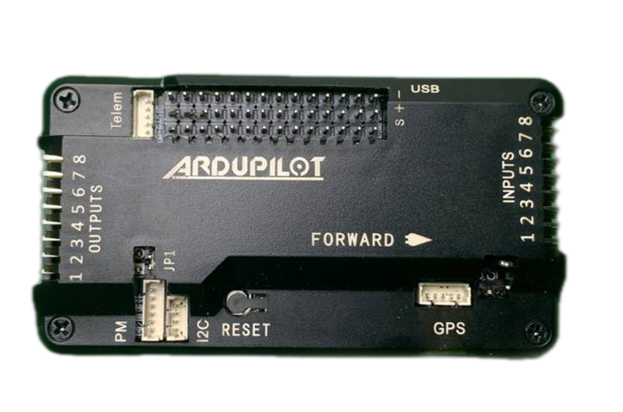
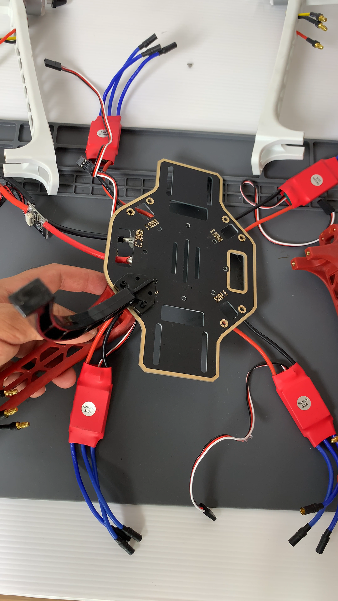
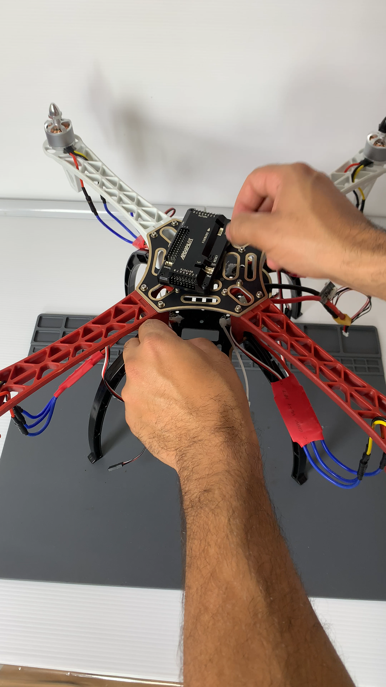
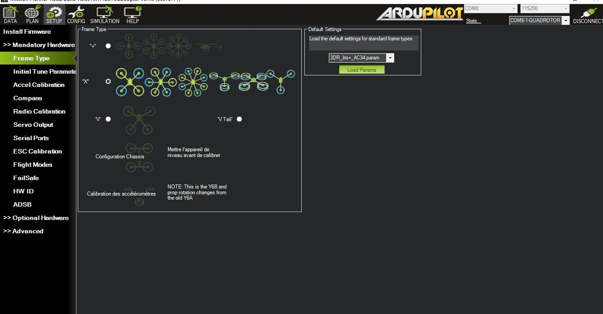

# Drone01-F450

Ce projet est un guide pour débutants dont l’objectif est de monter pas à pas un drone DJI F450 et de comprendre les mécanismes de base des quadcopters.  
Ce guide couvre toutes les étapes nécessaires pour faire voler un drone. Le guidage GPS ou le système FPV ne sont pas inclus ici : ces parties feront l’objet de guides plus avancés.  

<br/>⚠️ Ce tutoriel a été réalisé avec un APM 2.8 en 2025, normalement non compatible avec Mission Planner. Toutefois, il peut être adapté avec une carte plus récente comme un Pixhawk 2.1 ou équivalent.

---

## 🛠 Matériel nécessaire

- Kit cadre F450
- 4 ESC 30 A
- 4 Moteurs brushless 2212 920kv (2 cw et 2 ccw)
- 4 Hélices 1045
- Ardupilot APM 2.8  (controleur de vol)
- Module alimentation pixhawk/apm
- FlySky FS-i6 émetteur
- Recepteur flysky iA6
- GPS NEO 7M avec Compas

---

## 🧠 Fonctionnement


Un drone, ou plus précisément un quadcopter, est un appareil volant souvent radiocommandé composé de 4 moteurs qui lui permettent de se maintenir en vol.  
Ces moteurs sont disposés sur les 4 bras de son châssis, chacun équipé d’une hélice.  

Le quadcopter peut se déplacer selon 3 axes, appelés en aéronautique :  

- **Roulis (Roll)**  
- **Tangage (Pitch)**  
- **Lacet (Yaw)**  


Le déplacement autour de ces 3 axes est rendu possible grâce aux capteurs suivants :  

- **Accéléromètre**  
  - Mesure l’accélération (en m/s² ou en g) sur les 3 axes X, Y et Z.  
- **Gyroscope**  
  - Mesure la vitesse de rotation autour de chaque axe (X, Y, Z), généralement en degrés par seconde (°/s) ou en radians par seconde.  

Ces capteurs permettent le décollage et le contrôle du drone dans l’espace.  

Un quadcopter utilise **2 moteurs CW (Clockwise)** et **2 moteurs CCW (Counter-Clockwise)**.  
Leur disposition est cruciale et doit respecter un schéma précis pour que le drone puisse voler correctement.  
⚠️ Il est également essentiel d’utiliser les hélices adaptées à chaque moteur (CW et CCW).


Le déplacement du drone résulte d’une variation de la vitesse de rotation de chaque moteur.  
Exemple : pour avancer, les moteurs avant tournent légèrement moins vite que les moteurs arrière, ce qui incline le drone vers l’avant.  

Le phénomène physique à l’origine de la portance est lié à la mécanique des fluides, en particulier à deux effets combinés :  

- **L’effet Bernoulli (différence de pression)**  
  - La forme profilée de l’hélice (comme une aile d’avion) crée une différence de pression entre la face supérieure et la face inférieure.  
  - L’air circule plus rapidement sur le dessus → pression plus faible.  
  - L’air circule plus lentement en dessous → pression plus forte.  
  - Cette différence de pression génère une force qui pousse l’hélice vers le haut : c’est la portance ou la poussée verticale.  

- **Action-réaction (3e loi de Newton)**  
  - En tournant, l’hélice repousse l’air vers le bas.  
  - En réaction, une force de même intensité mais opposée agit vers le haut, ce qui soulève le drone.  
  - Plus la vitesse de rotation est élevée, plus la poussée générée est importante.  


### Composition 

> Chassis

Le châssis est l’élément qui relie tous les composants du drone entre eux.  
Dans notre cas, il est composé de 4 bras ainsi que d’une partie inférieure intégrant un circuit de distribution d’alimentation (+ et -), ce qui est pratique pour éviter d’avoir à en acheter un séparé.  


> **ESC (30 A)**

Un ESC (Electronic Speed Controller) est un contrôleur électronique qui régule la vitesse, le sens de rotation et parfois le freinage d’un moteur brushless de drone.  
Un ESC possède trois fils de sortie car il alimente le moteur en courant triphasé, nécessaire au fonctionnement des moteurs brushless.  


> Moteur 2212 920kv brushless cw et ccw

Le moteur de drone permet à celui-ci de décoller et se déplacer dans les airs.
Il est composé d'aiment et de bobine de cuivre qui lorsqu'il est traversé par un courant électrique créer un champ magnétique et créer un mouvement de rotation.
Le terme brushless signifie qu'il n'ya pas de contact entre les bobines et les aiments, donc meilleur durée de vie que les moteurs classqiues et chauffent moins.
1 Kv représente 1 rotation par minute du moteur pour 1v donc 
```bash
Vitesse = 920 × 11,1 ≈ 10 212 tours/minute
```

A savoir :

- KV bas (ex : 920 KV) → moteur tourne moins vite, mais avec plus de couple → idéal pour hélices plus grandes, vol stable, meilleure autonomie.

- KV haut (ex : 2300 KV) → moteur tourne plus vite → pour petites hélices, plus de vitesse, mais moins d’autonomie.

Et le 2212 ?

- 22 = diamètre du stator (22 mm)

- 12 = hauteur du stator (12 mm)


> Hélices 1045

L’hélice, comme vous vous en doutez, permet de faire voler le drone grâce à la force de l’air exercée sur ses pales.  
Nous utilisons des hélices **1045**, de type **CW** (Clockwise) et **CCW** (Counter Clockwise), au nombre de deux pour chaque sens de rotation.  

Le sens de rotation d’une hélice peut être déterminé en observant sa partie surélevée : elle tourne toujours dans le même sens que le moteur associé.  

⚠️ Une mauvaise disposition des hélices peut empêcher l’appareil de décoller ou provoquer une perte de contrôle.  


> **Controleur de vol (APM 2.5, 2.6, 2.8)**
 


Il s’agit du **cerveau de notre drone** : la carte de vol.  
Elle reçoit les commandes de la radiocommande, les interprète et les transforme en vitesses de rotation des moteurs, permettant ainsi au drone de se déplacer.  

Elle embarque également un accéléromètre et un gyroscope.  
<br>À l’heure où j’écris ces lignes, cette carte est **obsolète** : elle peut encore être utilisée, mais aucun firmware supérieur à la version **3.3.0** ne peut y être installé.  

Dans ce guide, j’utilise la version **APM 2.8**.  
<br>Ci-dessous, la carte sans son boîtier de protection :  


> Radio Commande

La radiocommande est composée d’un **émetteur**, utilisé par le pilote, et d’un **récepteur** placé sur le drone.  
Le récepteur lit les commandes du pilote et les transmet directement au contrôleur de vol.  

Dans ce guide, nous utilisons la **FlySky FS-i6**, une radiocommande très abordable qui offre néanmoins une bonne portée (environ **1,5 km en champ libre**).  
Elle fonctionne dans la bande des **2,4 GHz**, la même que celle utilisée par le Wi-Fi et le Bluetooth.  


> Module GPS Neo7m équipé d'un compas

Le module GPS permet de déterminer la position exacte du drone sur la planète grâce à la **trilatération**.  
Il reçoit les signaux envoyés par plusieurs satellites du réseau GPS, chacun transmettant sa position et l’heure d’émission.  
En mesurant la différence de temps entre l’envoi et la réception de ces signaux, le GPS calcule la distance à chaque satellite, puis déduit sa position précise (**latitude, longitude, altitude**) en combinant ces données.

Le **compas électronique**, généralement intégré sous la forme d’un magnétomètre, mesure l’orientation par rapport au **champ magnétique terrestre**.  
Il détecte l’intensité et la direction du champ magnétique sur les trois axes (X, Y, Z), ce qui permet de calculer un angle absolu par rapport au **Nord magnétique**.  
Associé au **gyroscope** et à l’**accéléromètre**, il offre une mesure de cap plus stable et plus précise, même lorsque le drone est en mouvement.


> Module d'alimentation

Le module d’alimentation n’est pas obligatoire lorsqu’on construit un drone, comme c’est souvent le cas pour les drones freestyle FPV.  
Cependant, il peut s’avérer très utile :  

- Il est chargé de distribuer l’énergie de la batterie à l’ensemble du drone.  
- Il peut supporter une batterie jusqu’à 6S, ce qui permet de surdimensionner sans risque de tout brûler.  
- Il alimente également le contrôleur de vol en **5,3 V jusqu’à 3 A** via le connecteur BEC, ce qui permet d’y brancher facilement une caméra analogique ou même un gimbal.  
- Il peut aussi mesurer le niveau de la batterie et transmettre l’information au contrôleur de vol.


> Batterie

La batterie permet de délivrer l’énergie électrique nécessaire aux moteurs et à toute l’électronique embarquée (ESCs, contrôleur de vol, caméra, GPS, etc.).  
Dans notre cas, nous utilisons une batterie **LiPo (Lithium Polymère) 4S 6200 mAh**.  

- **4S** signifie que la batterie est composée de 4 cellules de 3,7 V en série, ce qui donne une tension totale de **14,8 V**.  
- **6200 mAh** correspond à une capacité de 6,2 Ah, ce qui signifie qu’elle peut théoriquement délivrer **6,2 A pendant 1 heure** (ou 12,4 A pendant 30 minutes, etc.).  

⚠️ Une batterie LiPo est un composant très sensible qui nécessite des précautions particulières :  
- Elle supporte un nombre limité de cycles de charge et de décharge.  
- Il est recommandé de ne pas la décharger en dessous de **20 %** pour prolonger sa durée de vie.  
- Une configuration de failsafe adaptée est présentée dans la partie **configuration** de ce guide.  


---

## 🔌 Schéma de câblage


---


## 📷 Assemblage


Il faut commencer par souder les ESCs sur la partie inférieure du châssis du drone.  
Le châssis intègre des pistes de distribution d’alimentation reliant les ESCs à l’alimentation principale.  
Il faut donc souder les 4 ESCs sur les bornes **+** et **-** de chaque côté, puis souder le module d’alimentation sur les bornes **+** et **-** qui lui sont dédiées.  


Une fois les soudures effectuées, il est important d’isoler les parties conductrices exposées afin d’éviter tout court-circuit ou risque de corrosion.  
On peut utiliser un pistolet à colle chaude pour réaliser cette opération.  


<br/>

On doit ensuite fixer chaque moteur sur chacun des bras du châssis.  


On monte ensuite le train d’atterrissage sous le châssis et fixé aux bras de celui-ci.   



On branche les ESCs aux moteurs dans n’importe quel ordre. Il faudra ensuite vérifier que les moteurs tournent dans le bon sens en se référant au schéma de fonctionnement.  
Si un moteur ne tourne pas dans le bon sens, il suffit d’inverser deux fils (peu importe lesquels) entre l’ESC et le moteur.  
Les moteurs **CW** et **CCW** se distinguent par le pas de vis prévu pour fixer les hélices correspondantes.  


On fixe la partie supérieure du châssis au reste du drone.  


On place le contrôleur de vol au-dessus du châssis et on sécurise tous les éléments qui dépassent avec des colliers de serrage, comme les ESCs et le récepteur de la radiocommande.  





Ajoute ensuite le récepteur radio, que tu fixeras à l’aide de colliers de serrage, ainsi que le support du GPS, qui se visse directement sur le châssis.
Branche ensuite le récepteur radio sur les broches Inputs de l’APM, le module d’alimentation sur le port PM, et le GPS sur les connecteurs GPS et Compass.


Il ne reste plus qu’à brancher les moteurs sur les broches Outputs, en se référant au schéma de câblage présenté au début.


Il ne reste plus qu’à monter les hélices, et le drone sera quasiment prêt à voler.


---

## 📷 Configuration & Calibration

Pour configurer le drone, il faut au préalable avoir installé Mission Planner sur votre ordinateur, puis connecter le drone soit par câble USB, soit via le module de télémétrie.

<br/> La première étape consiste à mettre à jour le **firmware**. Le firmware est le logiciel intégré dans le contrôleur de vol : c’est lui qui permet de faire fonctionner et de coordonner tous les équipements du drone.


 

Choix du cadre de notre drone : dans notre cas, nous ne modifions rien, car il est déjà configuré en quadcopter.



> 1 Accéleromètre

Pour calibrer l’accéléromètre, il faut cliquer sur Calibrate Accel et suivre les instructions affichées.
Le logiciel demandera de positionner le drone dans différentes orientations (à l’avant, sur le côté, sur le dos, etc.).
⚠️ Assurez-vous que le drone soit bien de niveau avant de commencer la calibration de l’accéléromètre.


> 2  Compas

Cette étape n’est pas nécessaire si vous n’utilisez pas le GPS et le compas.
Cependant, elle peut être utile pour exploiter les fonctionnalités avancées de Mission Planner, comme le RTL (Return To Launch) ou l’exécution de missions autonomes, que nous n’aborderons pas dans ce guide.

La calibration du compas se réalise dans le menu **Mandatory Hardware > Compass**.
Puisque nous avons installé un module GPS avec compas intégré, nous sélectionnons APM and External Compass et cliquons sur Live Calibration.

<br/> Comme pour l’accéléromètre, le drone doit être bien de niveau avant de lancer la calibration. De plus, il doit pointer vers le **Nord** dans l’onglet *Data*. L’alignement parfait est difficile à obtenir, mais il faut s’en approcher le plus possible.


> 3 Radio

La calibration de la radiocommande se réalise dans le menu **Mandatory Hardware > Radio Calibration**.
Assurez-vous que le récepteur soit correctement appairé (bindé) avec la radiocommande, sans quoi celle-ci ne fonctionnera pas.


> 4 Batterie

Pour protéger votre batterie et prolonger sa durée de vie, il est important qu’elle ne se décharge pas complètement. Nous allons donc indiquer au drone de s’arrêter lorsqu’il atteint un seuil défini comme critique.
Le contrôleur de vol APM est capable de lire le niveau de la batterie en activant l’option **Battery Monitor** dans le menu **Optional Hardware**.


Notre batterie est chargée à **100 %** lorsque la tension atteint **16,8 V** et considérée vide à **12,8 V**.  
Descendre en dessous de cette valeur risque d’endommager la batterie.  

Comme la tension varie en fonction de l’effort demandé, il est conseillé de garder une marge de sécurité :  
- En général, on coupe le drone entre **13,6 V et 13,8 V**.  

Dans mon cas, j’ai choisi de fixer le seuil à **14 V**, mais **13,8 V** est tout à fait correct également.  

L’option **FailSafe** définit le comportement du drone si une chute de tension suffisamment longue est détectée sous le seuil choisi.  
Ici, nous activons l’option **Enabled Always Land**, qui ordonne au drone de se poser automatiquement.


> 5 ESCs

La calibration des ESCs permet d’harmoniser la vitesse de rotation des moteurs afin d’éviter qu’un moteur tourne plus vite ou plus lentement que les autres, ce qui dégraderait la stabilité du drone.  

Il existe deux méthodes :  
- Via **Mission Planner** dans le menu **ESC Calibration**  
- Manuellement  

Ici, j’ai choisi de réaliser la procédure **manuellement** à l’aide de la radiocommande.  

### Étapes de calibration manuelle :  
1. Brancher le moteur sur le pin **3** du récepteur.  
2. Connecter un couple **+ / -** de l’ESC à un couple **+ / -** du contrôleur de vol.  
3. Allumer la radiocommande et pousser le stick gauche au maximum vers le haut.  
4. Brancher la batterie et attendre le **bip sonore** produit par l’ESC.  
5. Répéter l’opération pour **tous les ESCs**.  


---

## 📷 Premier vol

Si vous êtes arrivé jusqu’ici, bravo 🎉 ! Votre drone est prêt à voler.  
Il ne reste plus qu’à le sortir sur un terrain dégagé et préparer les dernières étapes.  

>  Branchement de la batterie

Il suffit de connecter la batterie au connecteur du module d’alimentation du drone et de bien l’attacher au châssis.


> Armement du drone avec la radiocommande

Pour que le drone décolle, il faut l’armer (lancer les moteurs et activer la lecture des commandes).  
Pour ce faire, maintenez le stick gauche en bas à droite pendant quelques secondes.  

Si le drone est armé correctement, les moteurs devraient commencer à tourner tout seuls à bas régime.  

⚠️ Si vous avez des soucis pour armer le drone, consultez la section **Trucs et astuces** à la fin du guide.


> Décollage et pilotage

Pour faire décoller le drone, il suffit de lever le stick gauche correspondant au **CH3 (Throttle / accélérateur)**, puis de jouer avec les autres canaux pour le stabiliser ou le faire se déplacer.  

Pour mieux comprendre chaque mouvement du drone, voici un rappel des canaux de la radiocommande et de leur correspondance avec les déplacements du drone :  


> Désarmement du drone

Lorsque vous faites atterrir votre drone, les hélices continuent de tourner.  
Si vous souhaitez le désarmer afin de le manipuler ou de le ranger, il suffit de maintenir le stick gauche vers le **bas gauche** de votre radiocommande.


> Reverse du channel 2

Si, comme dans mon cas, lorsque vous essayez d’avancer le drone part en arrière, il faut inverser le **channel 2** dans la configuration de la radiocommande :  

- Restez appuyé sur **OK**.  
- Allez dans le menu **Functions Setup** via la flèche **Down** et **OK**.  
- Appuyez sur **OK** dans la fonction **Reverse**.  
- Déplacez le curseur sur le **CH2** avec le bouton **OK**.  
- Appuyez sur **Down** pour appliquer le reverse au **CH2**.  


---

## 📷 Truc et astuces

  
- **Erreur : Bad compass health**

    Si vous obtenez le message d’erreur *Bad compass health* dans Mission Planner, cela signifie que votre compas n’est pas reconnu.  
    Pour résoudre ce problème, vous avez deux options :  
    1. Utiliser un module GPS avec compas intégré et choisir **External Compass**.  
    2. Utiliser le compas interne du contrôleur de vol.  
       → Souder les pins **jumper 2 et 4**.


- **Arming fail à cause de la vérification GPS**

    Si le drone ne s’arme pas lorsque vous suivez la procédure du premier vol, c’est probablement dû à un problème dans le processus de vérification avant armement.  
    Pour contourner ce problème, vous pouvez désactiver ces vérifications dans le menu :  
    **Full Parameter List > ARMING_CHECK**  
    → Remplacez la valeur par **0**.  

    ⚠️ N’oubliez pas de cliquer sur **Write Params** pour que la modification soit prise en compte par votre contrôleur de vol.


- **Jumpers sur le contrôleur de vol**

    Après plusieurs recherches sur Internet, j’ai constaté que la documentation concernant les jumpers 1, 2, 3 et 4 est très limitée. Voici néanmoins les informations que j’ai pu trouver :  

    - **Jumper 1** : nécessaire pour l’alimentation.  
    - **Jumper 2 (MAG)** : doit être relié pour utiliser le compas interne du contrôleur de vol.  
    - **Jumper 3 (DFU)** : utilisé pour mettre la carte en mode DFU et permettre de flasher le bootloader.  
    - **Jumper 4** : doit être relié si l’on veut utiliser un compas externe.


---

## 📝 Le petit mot de la fin

J’espère que le projet t’a plu et que tu t’es amusé !
Si ce type de projet t’intéresse, n’hésite pas à liker et partager un maximum sur les réseaux.
Tu peux aussi laisser un commentaire si tu as réussi à le reproduire !

---

## ✍️ Nos projets

StarLab — Passionné d'électronique, robotique, d'aviation, de l'espace & projets DIY  

[YouTube](https://youtube.com/@starlab_974) | [TikTok](https://www.tiktok.com/@starlab_974) | [Instagram](https://www.instagram.com/starlab_974)

AquaLab — La téchnologie au service du monde marin & la nature dans une ambiance SolarPunk.

[YouTube](https://youtube.com/@aqualab_974) | [TikTok](https://www.tiktok.com/@aqualab_974) | [Instagram](https://www.instagram.com/aqualab_974)


---

## 🔗 Ressources utiles

- [Axes de rotation d'un aéronef](https://fr.wikipedia.org/wiki/Axes_de_rotation_d'un_a%C3%A9ronef)
- https://ardupilot.org/copter/docs/common-apm25-and-26-overview.html
- https://ardupilot.org/copter/docs/common-connecting-the-radio-receiver-apm2.html
- https://ardupilot.org/copter/docs/connecting-the-apm2.html
- https://hackaday.io/page/7188-calibrate-apm-28-using-mission-planner
- https://ardupilot.org/copter/docs/archived-gps-failsafe.html
- https://ardupilot.org/rover/docs/parameters-Rover-stable-V4.1.3.html#arming-check-arm-checks-to-perform-bitmask  
---

## 📄 Licence

Ce projet est open-source, sous licence MIT.  
N'hésitez pas à le modifier, le partager ou y contribuer.